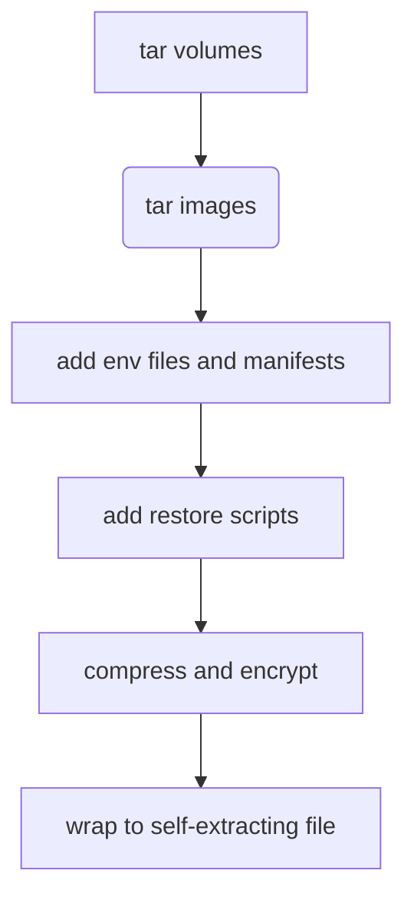

# DKP - DocKer compose Packer


Packs existent docker-compose project in self-complete single file ecnrypted
(GPG AES256) archive (tar + gz). It means, that you don't need to install DKP or
remember details during restoration which drammaticaly reduces stress and make
your life simpler. In the end - it's hard to remember how to restore backup made
by N generations of adminsitrators years ago before you...

The pipeline is:



For backup you need:

- gpg
- python3 3.9+ (see tests in workflow)
- sh
- tar
- gzip
- docker with compose plugin

For restore you need:

- gpg
- sed
- tar
- gzip

## Installation

**Recomended**

    pip install dkp

Alternative - just download [dkp/dkp.py] and make it executable.

**Docker**

    docker run --rm -e PASSPHRASE=foobar -v $(pwd):/data ghcr.io/reddec/dkp -o /data/backup.bin <project>

## Backward compatibility

Once backup created, the version of DKP doesn't matter anymore since archive is
self-complete independent file.

New DKP versions may introduce more features as well as different layout of
final archive, but it will not affect previous backups.

## Usage

### Create backup

```
usage: dkp [-h] [--output OUTPUT] [--skip-images] [--passphrase PASSPHRASE] [project]

DocKer compose Packer - backup compose project with all batteries included

positional arguments:
  project               Compose project name. Default is docker-compose-pack

options:
  -h, --help            show this help message and exit
  --output OUTPUT, -o OUTPUT
                        Output file. Default docker-compose-pack.bin
  --skip-images, -S     Do not archive images
  --passphrase PASSPHRASE, -p PASSPHRASE
                        Passphrase to encrypt backup. Can be set via env PASSPHRASE
```

### Restore

```
Usage:

./path/to/backup/file [--restore/-r] [-s/--start] [-h/--help] [passphrase]

   passphrase      Key to decrypt archive. Can be set by env PASSPHRASE

  -h, --help       Show this help
  -r, --restore    Automatically restore project after unpacking
  -s, --start      Automatically start project after unpacking. Implicitly enables --restore
```
