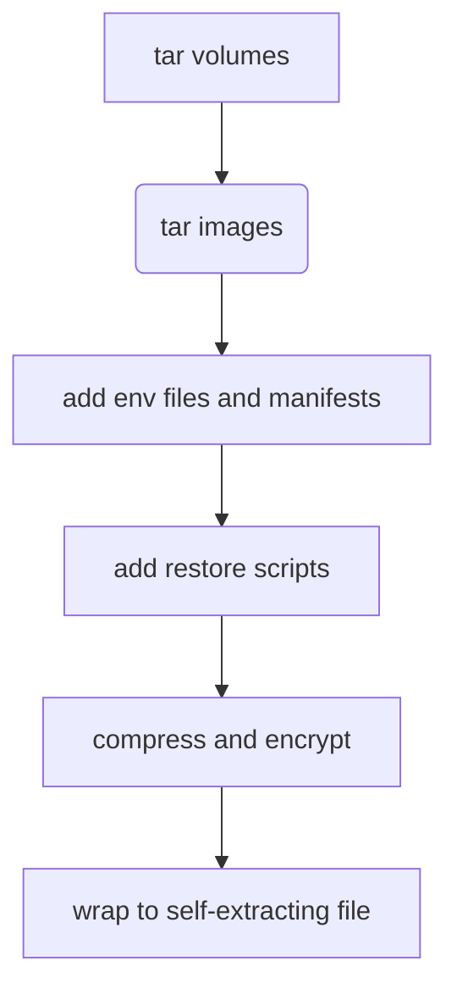

# DKP - DocKer compose Packer

[](https://pypi.org/project/dkp/)

Packs existent docker-compose project in executable single encrypted (GPG
AES256) archive (tar + gz). It means that you don't need to install DKP or
remember procedure details during restore, which dramatically reduces stress and
make your life simpler. In the end - it's hard to remember how to restore backup
made by N generations of administrators years ago before you...

The pipeline is:



For backup you need:

- gpg
- python 3.8+ (see tests in workflow)
- sh
- tar
- gzip
- docker with compose plugin

For restore you need:

- gpg
- sed
- tar
- gzip

## Installation

**Recommended**

    pip install dkp

Alternative - just download [dkp/dkp.py](dkp/dkp.py) and make it executable.

## Backward compatibility

Once backup created, the version of DKP doesn't matter anymore since archive is
self-complete independent file.

New DKP versions may introduce more features as well as different layout of
final archive, but it will not affect previous backups.

## Usage

### Create backup

```
usage: dkp [-h] [--output OUTPUT] [--skip-images] [--all-images]
           [--passphrase PASSPHRASE] [--env-file [ENV_FILE ...]]
           [project]

Docker Compose packer - pack compose project with all batteries included

positional arguments:
  project               Compose project name. Default is docker-compose-pack

options:
  -h, --help            show this help message and exit
  --output OUTPUT, -o OUTPUT
                        Output file. Default docker-compose-pack.bin
  --skip-images, -S     Do not archive images
  --all-images          Export all images. Without this option, only the
                        images of those services are exported that have an
                        'image' key in the compose file.
  --passphrase PASSPHRASE, -p PASSPHRASE
                        Passphrase to encrypt backup. Can be set via env
                        PASSPHRASE
  --env-file [ENV_FILE ...]
                        Environment file(s) that should be passed to Compose
                        with '--env-file'
```

Caveat: The `--env-file` option works according to the default behavior of the
`argparse` module, not according to the Docker CLI conventions.

1.  You should pass the `--env-file` option only once, and enumerate the files
    afterwards (`--env-file env1 env2`). If you write `--env-file env1
    --env-file env2`, the second option overwrites the first, and only `env2` is
    used.

2.  You can use `--` before the project name when you use `--env-file` before
    it. This might be necessary because `--env-file env project` means that you
    have two env files (one called `env` and the other called `project`).

### Restore

```
Usage:

./path/to/backup/file [--restore/-r] [-s/--start] [-h/--help] [passphrase]

   passphrase      Key to decrypt archive. Can be set by env PASSPHRASE

  -h, --help       Show this help
  -r, --restore    Automatically restore project after unpacking
  -s, --start      Automatically start project after unpacking. Implicitly enables --restore
```

## Troubleshooting

# Error when restoring: "gzip: stdin: not in gzip format"

*   Symptom: The following error is printed when trying to restore a pack.

    ```
    $ ./test.pack
    unpacking to test-data

    gzip: stdin: not in gzip format
    tar: Child died with signal 13
    tar: Error is not recoverable: exiting now
    ```

*   Reason: The pack is protected with a passphrase using GPG. Run the same pack
    file with a passphrase:

    ```
    $ ./test.pack [passphrase]
    ```

    Or:

    ```
    $ PASSPHRASE=my_passphrase ./test.pack
    ```

# Error when restoring: "gpg: no valid OpenPGP data found"

*   Symptom: The following error is printed when trying to restore a pack.

    ```
    $ ./test.pack my_passphrase
    decrypting and unpacking to test-data
    gpg: no valid OpenPGP data found.
    gpg: decrypt_message failed: Unknown system error

    gzip: stdin: unexpected end of file
    tar: Child returned status 1
    tar: Error is not recoverable: exiting now
    ```

*   Reason: The pack is *not* protected with a passphrase. Run the same pack
    file without a passphrase, and ensure that the `PASSPHRASE` environment
    variable is not set (or set to an empty string).

    ```
    $ ./test.pack
    ```
